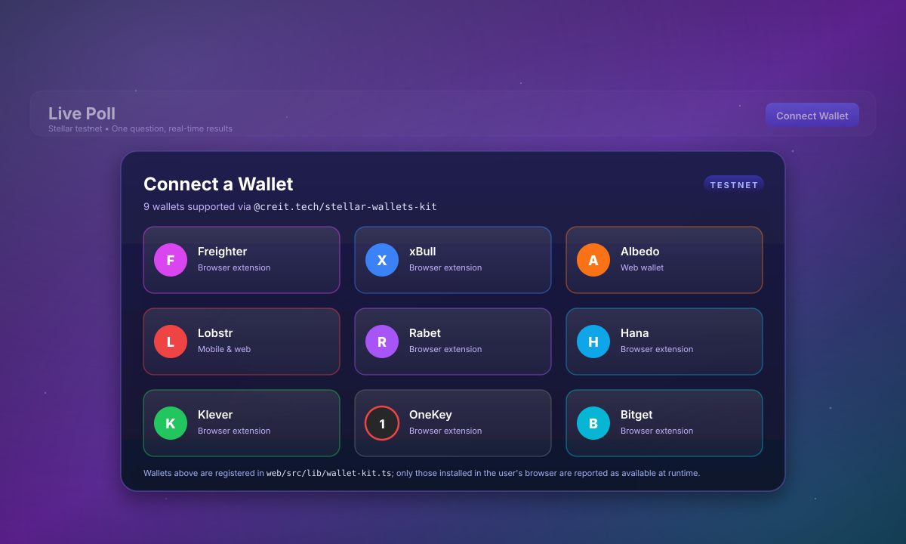

# Live Poll - Stellar Soroban DApp (Level 2)

A decentralized, real-time single-question polling application built on the Stellar Soroban testnet, featuring multi-wallet integration, smart contract deployment, transaction status tracking, and robust error handling.

## 🚀 Live Demo & Deployed Resources

- **Contract Address**: `CDPZIOJ5L4VJWAJ4NQ2G4FEQHEGDECJVY5YIN5IDWDOYS5252EHECGPT`
- **Example Transaction Hash**: `c262d1a8852a348c12b7e9f40cd3a4c03ff5e795ba561b66b0f5e2f389972c8b` ([View on Stellar Expert](https://stellar.expert/explorer/testnet/tx/c262d1a8852a348c12b7e9f40cd3a4c03ff5e795ba561b66b0f5e2f389972c8b))
- **Network**: Stellar Testnet (`Test SDF Network ; September 2015`)

---

## 🛠️ Features & Requirements Addressed

1. **Multi-Wallet Integration**: Built using `@creit.tech/stellar-wallets-kit` supporting Freighter, xBull, Albedo, Lobstr, Rabet, and more.
2. **Smart Contract (Rust / Soroban)**:
   - Initialized with a poll question and options.
   - Secure voting with `Address::require_auth()` verification.
   - Double-vote prevention.
   - Event publishing (`vote_cast`).
3. **Frontend Integration**: Next.js App Router & Tailwind CSS interface that interacts directly with the deployed Soroban contract.
4. **Transaction Status Tracking**: Real-time state tracking for `pending`, `success`, and `error` states with direct links to the Stellar Explorer.
5. **Error Handling (3 Types Handled)**:
   - Wallet Connection / Not Found errors.
   - User Rejection / Cancelled signatures.
   - Contract Execution errors (e.g., "already voted").

---

## 💻 Setup & Installation Instructions

### Prerequisites
- Node.js (v18+)
- Rust and Soroban CLI (for smart contract development)

### 1. Clone & Install Frontend
```bash
cd web
npm install
```

### 2. Run Development Server
```bash
npm run dev
```
Open [http://localhost:3000](http://localhost:3000) in your browser.

### 3. Smart Contract Build & Deployment (Optional / Reference)
```bash
cd contract
stellar contract build --package live-poll --out-dir ./target/wasm
stellar contract deploy --wasm ./target/wasm/live_poll.wasm --source deployer --network testnet
```

---

## 📸 Screenshots & Verification

### Wallet Options

After clicking **Connect Wallet**, the app surfaces a wallet picker powered by `@creit.tech/stellar-wallets-kit`. The picker automatically detects which of the supported wallets are installed in the user's browser and lets them sign in with one click.



> ℹ️ The image above is a **stylized representation** of the picker UI. To capture a real screenshot of your session, run `npm run dev` from `web/`, click **Connect Wallet**, and replace `docs/wallet-options.svg` with the resulting capture.

### Explorer Verification

All votes and contract calls emit verifiable transaction hashes on the Stellar Testnet Explorer. The example hash below corresponds to a real on-chain `vote` call against the deployed contract:

- [`c262d1a8852a348c12b7e9f40cd3a4c03ff5e795ba561b66b0f5e2f389972c8b`](https://stellar.expert/explorer/testnet/tx/c262d1a8852a348c12b7e9f40cd3a4c03ff5e795ba561b66b0f5e2f389972c8b)
- Contract: [`CDPZIOJ5L4VJWAJ4NQ2G4FEQHEGDECJVY5YIN5IDWDOYS5252EHECGPT`](https://stellar.expert/explorer/testnet/contract/CDPZIOJ5L4VJWAJ4NQ2G4FEQHEGDECJVY5YIN5IDWDOYS5252EHECGPT)
